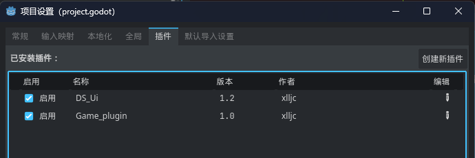

[**English**](./README.md) | **中文简体**

主分支长时间不更新？请切换到[develop](https://github.com/xlljc/GunfireDungeon/tree/develop)分支查看最新代码

## 一款由Godot开发的地牢射击类型的游戏

**Godot版本：** `4.4 mono`

**.Net版本：** `9.0`

---
### 游戏定义

**游戏名称：**《枪火地牢》

**英文名称：**《Gunfire Dungeon》

**美术风格：** 2D像素

**游戏标签：** Roguelite，俯视角，地牢探索，双摇杆射击

**参考游戏：** 《挺进地牢》，《Noita》

**核心简介：** 游戏整体流程由数层地牢组成，每层又由数个房间组成，每个房间有一堵门隔开，玩家每进入一个房间，需要清理房间内所有的敌人，方可离开和进入下一个房间，玩家需要在这些房间中探索，战斗，收集掉落的道具和被动，一步步成长，击败boss，进入下一层，如此往复，直到击败最后一层boss即可通关。

**游戏背景：** 构思中

**游戏内置了一个功能强大的地图编辑器，方便玩家自己制作地图和分享地图**

---
### 预览图

##### 游戏中

##### 地图编辑器

房间管理器

房间地形编辑

房间装饰编辑

房间预设编辑

---
### 启动项目

git仓库的目录结构如下
> ├ GunfireDungeon_Document (更新日志相关的目录) 
>
> └ GunfireDungeon_Godot (Godot工程目录)

请确保安装了`.net9`和`godot mono4.4`

godot下载地址：[https：//godotengine.org/download](GunfireDungeon_Document/文档资源/setting.png)

.net9下载地址：[https：//dotnet.microsoft.com/zh-cn/download/dotnet/9.0](GunfireDungeon_Document/文档资源/setting.png)

使用GodotMono版打开`GunfireDungeon_Godot/project.godot`

并且第一次打开请启用这两个插件：

---
### 其他

**开发日志：** [开发日志.md](GunfireDungeon_Document/开发日志.md) 

**哔哩哔哩：** [https：//space.bilibili.com/259437820](GunfireDungeon_Document/文档资源/setting.png)

**项目Ui插件：** [https：//github.com/xlljc/Ds_Ui](GunfireDungeon_Document/文档资源/setting.png)